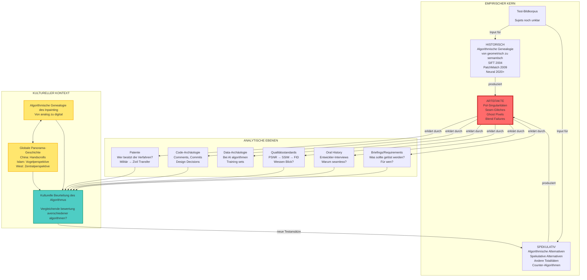

# Die Ästhetik der Plausibilität: Eine praxis-basierte Medienarchäologie algorithmischer Bildvervollständigung

## Abstract (300 Wörter)

Diese Dissertation untersucht Inpainting-Algorithmen in der digitalen Panoramaerstellung durch systematische Analyse ihrer Artefakte. Die zentrale These: Algorithmische "Fehler" - von Pol-Singularitäten über Seam-Artefakte bis zu Unmöglichkeitspunkten - sind keine Defizite, sondern Erkenntnisfenster in die operative Logik einer neuen "Ästhetik der Plausibilität". Die Forschung folgt der Methode Harun Farockis und Trevor Paglens, minimale optische Ereignisse als Eingangspunkte in größere techno-politische Narrative zu lesen.

Methodisch entwickelt die Arbeit eine zirkuläre Praxis: Artefakte werden durch kontrollierte Experimente produziert, mittels multipler Analyseebenen (Patent-Archäologie, Code-Forensik, Standards-Geschichte) erklärt und zur Entwicklung alternativer Algorithmen genutzt. Diese praktische Arbeit - allein die Rekonstruktion historischer Implementierungen von SIFT (2004) bis Stable Diffusion (2024) ist aufwändige Forschung - macht den Hauptteil der Dissertation aus.

Die Arbeit zeigt, wie sich in der Evolution von geometrischen zu statistischen zu generativen Inpainting-Verfahren ein fundamentaler Wandel vollzieht: von der Rekonstruktion einer vermuteten Realität zur Konstruktion plausibler Fiktionen. Diese "Ästhetik der Plausibilität" - wo believable wichtiger wird als true - materialisiert sich in Default-Werten, Qualitätsmetriken und Optimierungszielen.

Die Dissertation leistet drei Beiträge: (1) Eine dokumentierte Methodologie für kritische Algorithmusforschung, die Code als historisches Dokument behandelt; (2) Das Open-Source Toolkit "Panoramic Alternatives" mit forensischen Analyse-Tools und alternativen Inpainting-Implementationen; (3) Eine theoretische Neukonzeption algorithmischer Bildvervollständigung als kulturelle Praxis, die spezifische Vorstellungen von visueller Kohärenz naturalisiert. Damit verbindet die Arbeit technische Computer Vision mit kritischen Medienstudien auf neue Weise.

## Gliederung des Exposés

### 1. Einleitung: Artefakte als epistemische Objekte

#### 1.1. Von der Fehleranalyse zur Artefakt-Epistemologie

**Frage:** Wie können algorithmische "Fehler" als systematische Erkenntnismethode für die Analyse von Panorama-Algorithmen operationalisiert werden?
**These:** Artefakte sind materialisierte Theorie - sie zeigen nicht was Algorithmen nicht können, sondern wie sie operieren und welche Konzepte von "Vollständigkeit" sie implementieren.
**Literatur:** Rheinberger (1997) "Epistemic Things", Daston & Galison (2007) "Objectivity", Parikka (2023) "Operational Images"
**Technologie:** Systematische Artefakt-Sammlung aus fünf paradigmatischen Implementierungen (OpenCV, Hugin, PatchMatch, MAT, Stable Diffusion)
**Argumentationsform:** Epistemologische Umwertung des Fehlerbegriffs

#### 1.2. Die Ästhetik der Plausibilität

**Frage:** Welcher ästhetische und epistemologische Wandel vollzieht sich, wenn Algorithmen nicht mehr rekonstruieren "was war", sondern konstruieren "was sein könnte"?
**These:** Inpainting-Algorithmen etablieren eine neue visuelle Episteme, in der statistische Plausibilität über indexikalische Wahrheit triumphiert.
**Literatur:** Steyerl (2009) "In Defense of the Poor Image", Hoelzl & Marie (2015) "Softimage", Paglen (2019) "Invisible Images"
**Technologie:** Vergleichende Analyse von "ground truth" vs. "perceptual quality" Metriken
**Argumentationsform:** Medienarchäologische Verschiebungsanalyse

## 2. Methodologische Positionierung

#### 2.1. Practice-Based Media Archaeology

**Frage:** Wie kann praktische Algorithmus-Arbeit selbst zur Forschungsmethode werden, die über traditionelle Analyse hinausgeht?
**These:** Die Rekonstruktion, Modifikation und das gezielte Scheitern-Lassen von Algorithmen ist nicht illustratives Beiwerk, sondern zentraler Erkenntnismodus - jede Code-Zeile wird zur epistemologischen Aussage, jeder Compile-Fehler zum Erkenntnismoment über implizite Annahmen.
**Literatur:** Candy & Edmonds (2018) "Practice-Based Research", Sullivan (2010) "Art Practice as Research", Ratto (2011) "Critical Making", Smith & Dean (2009) zu practice-based vs. practice-led
**Technologie:** Systematische Code-Archäologie durch: Git-History-Analyse, Dependency-Tracking, Build-System-Rekonstruktion, Comment-Forensik
**Argumentationsform:** Materiell-reflexive Wissensgenerierung durch Praxis

#### 2.2. Vom Artefakt zum Narrativ: Methodologie nach Farocki/Paglen

**Frage:** Wie lassen sich minimale technische Details als Eingangspunkte in größere techno-politische Erzählungen nutzen?
**These:** Jeder Artefakt erzählt drei Geschichten: eine technische (wie), eine symptomatische (warum) und eine kulturelle (was bedeutet das).
**Literatur:** Farocki (2004) "Phantom Images", Paglen (2014) "Operational Images", Elsaesser (2004) über Farocki
**Technologie:** Entwicklung eines dreistufigen Analyse-Protokolls
**Argumentationsform:** Mikro-zu-Makro Narrativierung

#### 2.3. Warum Algorithmen, nicht Plattformen? Eine methodologische Positionierung

**Frage:** Warum sind Algorithmen für eine medienarchäologische Untersuchung geeignetere Forschungsobjekte als die Plattformen, auf denen sie laufen?
**These:** Algorithmen operieren als stabile, untersuchbare "cognitive infrastructures" (Mackenzie) quer durch verschiedene Plattformen, während Plattformen zu personalisierten, instabilen und undurchsichtigen Blackboxes geworden sind.
**Literatur:** Mackenzie (2017) "Machine Learners", Gillespie (2014) "The Relevance of Algorithms", Bucher (2018) "If...Then"
**Technologie:** Vergleichende Analyse derselben Algorithmen-Implementierung across OpenCV, PIL, ImageMagick, Browser-APIs
**Argumentationsform:** Pragmatisch-epistemologische Objektwahl

#### 2.4. Medienarchäologie durch Code: Vom Lesen zum Schreiben

**Frage:** Wie erweitert das aktive Schreiben von Code die klassische Medienarchäologie über das bloße "Graben" in technischen Archiven hinaus?
**These:** Code-Produktion als medienarchäologische Methode ermöglicht ein "Nachvollziehen durch Nachbauen" - historische Implementierungen werden nicht nur analysiert, sondern re-enacted, wodurch verborgene Designentscheidungen und kulturelle Einschreibungen erfahrbar werden.
**Literatur:** Parikka (2012) "What is Media Archaeology?", Hertz & Parikka (2012) "Zombie Media", Marino (2020) "Critical Code Studies", Ernst (2013) zum "Nachvollzug"
**Technologie:** Entwicklung eines "Archaeological Coding Toolkit": Version-Control-Archäologie, Deprecated-API-Emulation, Historical-Compiler-Chains
**Argumentationsform:** Performative Geschichtsschreibung durch technische Re-Enactments

### 3. Theoretischer Rahmen: Operational Images und Code Studies

#### 3.1. Inpainting als Operational Image Process

**Frage:** Wie operationalisiert algorithmische Bildvervollständigung Parikkas Konzept der "Operational Images"?
**These:** Inpainting-Algorithmen produzieren Bilder die primär operieren (Lücken schließen, Kohärenz herstellen) statt repräsentieren.
**Literatur:** Parikka (2023) "Operational Images", Paglen (2014), Hoel (2018) "Operative Images"
**Technologie:** Frame-by-frame Analyse von Inpainting-Prozessen als operative Ketten
**Argumentationsform:** Theorieadaption von militärischen zu zivilen Bildoperationen

#### 3.2. Code als primäre Quelle

**Frage:** Wie kann Code selbst als historisches Dokument gelesen werden?
**These:** Comments, Variable Names, Magic Numbers und Git Commits sind kulturelle Artefakte, die Design-Philosophien und implizite Annahmen offenbaren.
**Literatur:** Marino (2020) "Critical Code Studies", Mackenzie (2017) "Machine Learners", Fuller (2008) "Software Studies"
**Technologie:** Git archaeology, systematische Comment-Analyse, Magic Number Extraktion
**Argumentationsform:** Code als Text mit kulturellen Einschreibungen

#### 3.3. Alternative Totalitätskonzepte

**Frage:** Welche anderen Vorstellungen visueller Vollständigkeit existieren jenseits der westlichen Zentralperspektive?
**These:** Die Dominanz bestimmter Inpainting-Logiken ist kontingent - andere kulturelle Traditionen böten alternative Modelle.
**Literatur:** Mitchell (2005) "What Do Pictures Want?", Elkins (2007) "Visual Studies", [Spezifische Recherche zu nicht-westlichen Panoramatraditionen nötig]
**Technologie:** Komparative Analyse verschiedener Vollständigkeitskonzepte
**Argumentationsform:** Denaturalisierung scheinbar universeller Standards

### 4. Empirischer Kern: Systematische Artefakt-Produktion

#### 4.1. Algorithmische Genealogie durch Praxis

**Frage:** Wie entwickelten sich Inpainting-Strategien von geometrischen zu statistischen zu generativen Ansätzen?
**These:** Jede Algorithmen-Generation materialisiert eine spezifische "Ästhetik der Plausibilität" mit charakteristischen Artefakt-Signaturen.
**Literatur:** Efros & Leung (1999), Criminisi et al. (2004), Barnes et al. (2009), Yu et al. (2019), Rombach et al. (2022)
**Technologie:** Praktische Rekonstruktion historischer Implementierungen - ein aufwändiger Prozess der Archäologie durch Code
**Argumentationsform:** Experimentelle Technikgeschichte
**Notizen:**Hier einen Satz wie: "Diese praktische Rekonstruktion folgt der Methodologie des Critical Making (Ratto 2011), bei der..."

#### 4.2. Strategisches Test-Korpus Design

**Frage:** Welche Bilder provozieren die aufschlussreichsten algorithmischen Artefakte?
**These:** Grenzfälle offenbaren die impliziten Annahmen von Algorithmen über visuelle Kohärenz.
**Literatur:** Crawford & Paglen (2019) "Excavating AI", Denton et al. (2020) über Dataset Bias
**Technologie:** Kuratiertes Set von 30 Testbildern in drei Kategorien: Mathematische Grenzfälle, Kulturelle Edge Cases, Historische Panoramen
**Argumentationsform:** Experimentelles Design als kritische Praxis

#### 4.3. Pol-Singularitäten als privilegierter Forschungsort

**Frage:** Was offenbaren mathematische Unmöglichkeitspunkte über algorithmische Vollständigkeitskonzepte?
**These:** An den Polen müssen Algorithmen ihre "wahre Natur" offenbaren - hier wird die Fiktion der Plausibilität am deutlichsten.
**Literatur:** Snyder (1987) "Map Projections", Latour (1987) "Science in Action"
**Technologie:** Systematische Analyse verschiedener Pol-Behandlungen
**Narrative Dimension:** Die "terra incognita" der digitalen Kartografie - was füllt die Leere wenn keine Daten existieren?

### 5. Multiple Erklärungsebenen für Artefakt-Analyse

#### 5.1. Patent-Archäologie: Die Ökonomie der Plausibilität

**Frage:** Wie wanderten Panorama-Algorithmen von militärischen zu zivilen Kontexten?
**These:** Patent-Geschichte offenbart den Wandel von "Präzision" zu "Plausibilität" als Optimierungsziel.
**Literatur:** Noble (1977) "America by Design", Hughes (1987) "Evolution of Large Technological Systems"
**Technologie:** Analyse von Schlüsselpatenten: US7409105 (2008), US8611654 (2013), US10467739 (2019)
**Narrative Dimension:** Vom Missile Guidance System zum Instagram Filter - eine Geschichte der Demokratisierung

#### 5.2. Code-Forensik: Eingeschriebene Normalität

**Frage:** Welche kulturellen Annahmen materialisieren sich in Default-Werten und Schwellwerten?
**These:** Magic Numbers sind kulturelle Artefakte - sie definieren was als "normal" oder "plausibel" gilt.
**Literatur:** Chun (2011) "Programmed Visions", Berry (2011) "Philosophy of Software"
**Technologie:** Systematische Extraktion und Analyse von Konstanten in fünf Major Implementations
**Narrative Dimension:** Die 0.7 Threshold - warum 70% "gut genug" für visuelle Kohärenz wurde

#### 5.3. Standards als Plausibilitäts-Regime

**Frage:** Wie entwickelten sich Qualitätsmetriken von objektiven zu subjektiven Maßstäben?
**These:** Der Wandel von PSNR über SSIM zu "perceptual metrics" dokumentiert die Institutionalisierung der Plausibilitäts-Ästhetik.
**Literatur:** Bowker & Star (1999) "Sorting Things Out", Busch (2011) "Standards"
**Technologie:** Analyse von Evaluationsmetriken in SIGGRAPH/CVPR Papers 2000-2024
**Narrative Dimension:** Wenn Maschinen lernen was Menschen "glaubwürdig" finden

### 6. Experimentelle Praxis: Rekonstruktion und Spekulation

**Notizen:** "Die folgenden Experimente verstehen sich als practice-based research im Sinne von Candy & Edmonds (2018), wobei..."

#### 6.1. Phase 1: Forensische Werkzeugentwicklung (Monate 7-12)

**Frage:** Wie können Inpainting-Artefakte systematisch detektiert und klassifiziert werden?
**These:** Jeder Algorithmus hinterlässt eine charakteristische "Handschrift" im Frequenzraum und in statistischen Mustern.
**Literatur:** Farid (2016) "Photo Forensics", Kirchner & Fridrich (2010)
**Technologie:** Entwicklung eines Analyse-Toolkits mit Fourier-Analyse, Statistical Pattern Detection, Benford's Law Tests
**Output:** Web-basierter "Inpainting Detector" als öffentliches Tool

#### 6.2. Phase 2: Algorithmische Grenzwertanalyse (Monate 13-24)

**Frage:** Was offenbaren systematische Edge Cases über die normativen Annahmen von Inpainting-Systemen?
**These:** An ihren Grenzen müssen Algorithmen ihre Prioritäten offenbaren - wo Heuristiken versagen, werden Design-Entscheidungen sichtbar.
**Literatur:** Bowker (2005) "Memory Practices", Star (1999) "Ethnography of Infrastructure"
**Technologie:** Kontrollierte Tests mit: 0% Überlappung, 95% Missing Data, Widersprüchlichen Constraints, Impossible Geometries
**Narrative Dimension:** Die Poetik des Scheiterns - wenn Algorithmen "aufgeben" müssen

#### 6.3. Phase 3: Counter-Inpainting Implementation (Monate 25-30)

**Frage:** Wie können alternative Vollständigkeitslogiken algorithmisch realisiert werden?
**These:** Jenseits der "seamlessness" existieren multiple Möglichkeiten mit visuellen Lücken umzugehen.
**Literatur:** Haraway (1988) "Situated Knowledges", Barad (2007) "Meeting the Universe Halfway"
**Technologie:** Drei alternative Implementierungen:

- "Honest Inpainting": Lücken bleiben als solche markiert
- "Palimpsest Mode": Alle Füllversuche bleiben sichtbar überlagert
- "Speculative Completion": Multiple mögliche Füllungen werden gleichzeitig angeboten
  **Output:** "Panoramic Alternatives" Open Source Toolkit

### 7. Erwartete Ergebnisse

#### 7.1. Praktische Outputs

- **Panoramic Alternatives Toolkit:** Python/JS Library mit alternativen Inpainting-Ansätzen
- **Forensic Analyzer:** Web-Tool zur Detektion verschiedener Inpainting-Algorithmen
- **Artefakt-Archiv:** Dokumentierte Sammlung charakteristischer Artefakte mit Reproduktionscode
- **Workshop-Materialien:** Für Künstler*innen und Journalist*innen

#### 7.2. Theoretische Beiträge

- Konzeptualisierung der "Ästhetik der Plausibilität" als neue visuelle Episteme
- Dokumentierte Methodologie für praxis-basierte Algorithmusforschung
- Erweiterung der Operational Image Theory auf zivile Kontexte

#### 7.3. Narrative Outputs

- Essay: "Die Demokratisierung der Fälschung: Von Staatsgeheimnissen zu Instagram"
- Web-Installation: "The Plausibility Machine" - interaktive Demonstration
- Bildband: Artefakt-Atlas mit kritischen Annotationen

### 8. Zeitplan

**Jahr 1: Grundlagen und Rekonstruktion**

- Monate 1-3: Theoretisches Framework, Literaturarbeit
- Monate 4-6: Praktische Rekonstruktion historischer Algorithmen (SIFT bis PatchMatch)
- Monate 7-9: Aufbau Forensik-Tools, Patent-Recherche
- Monate 10-12: Erste Artefakt-Analysen, Standards-Geschichte

**Jahr 2: Intensive Experimentierphase**

- Monate 13-18: Systematische Grenzwertanalyse
- Monate 19-24: Counter-Algorithm Development

**Jahr 3: Synthese und Dissemination**

- Monate 25-30: Tool-Finalisierung, letzte Experimente
- Monate 31-33: Dissertation schreiben
- Monate 34-36: Ausstellung, Workshops, Defense

### 9. Risikomanagement

- **Falls historische Implementierungen nicht rekonstruierbar:** Fokus auf gut dokumentierte Open Source Versionen
- **Falls Forensik-Tools nicht zuverlässig:** Pivot zu qualitativer Artefakt-Analyse
- **Falls Counter-Algorithmen nicht überzeugend:** Verstärkter Fokus auf kritische Analyse bestehender Systeme

### 10. Zentrale Bibliografie [Auszug]

**Theoretischer Rahmen:**

- Parikka, Jussi (2023). _Operational Images: From the Visual to the Invisual_. University of Minnesota Press.
- Farocki, Harun (2004). "Phantom Images." _Public_ 29: 12-22.
- Paglen, Trevor (2014). "Operational Images." _e-flux_ 59.

**Technische Grundlagen:**

- Barnes, Connelly et al. (2009). "PatchMatch: A Randomized Correspondence Algorithm." _ACM Transactions on Graphics_ 28(3).
- Criminisi, Antonio et al. (2004). "Region Filling and Object Removal by Exemplar-Based Image Inpainting." _IEEE TIP_ 13(9).
- Yu, Jiahui et al. (2019). "Free-Form Image Inpainting with Gated Convolution." _ICCV_.

**Kritische Perspektiven:**

- Steyerl, Hito (2009). "In Defense of the Poor Image." _e-flux_ 10.
- Mackenzie, Adrian (2017). _Machine Learners: Archaeology of a Data Practice_. MIT Press.
- Chun, Wendy Hui Kyong (2011). _Programmed Visions_. MIT Press.

[Vollständige Bibliografie umfasst 60+ Quellen aus Computer Science, Media Studies, STS]
